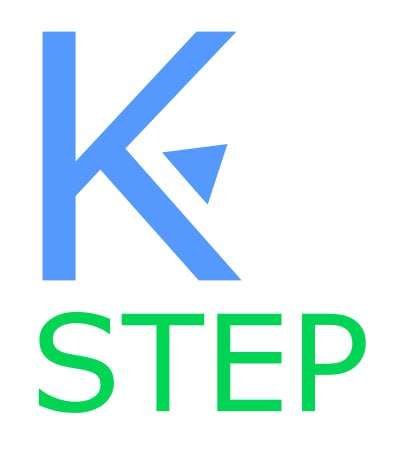

[![Contributors][contributors-shield]][contributors-url]
[![Forks][forks-shield]][forks-url]
[![Stargazers][stars-shield]][stars-url]
[![Issues][issues-shield]][issues-url]
[![MIT License][license-shield]][license-url]
[![LinkedIn][linkedin-shield]][linkedin-url]


<!-- PROJECT LOGO -->
<br />
<div align="center">
  <a href="https://github.com/PythonGuySup/KFU_SHOP_11_313">
    
  </a>

<h3 align="center">KFU_SHOP_313</h3>

  <p align="center">
    Online sneaker store
    <br />
    <a href="https://github.com/PythonGuySup/KFU_SHOP_11_313/tree/master/docs"><strong>Explore the docs »</strong></a>
    <br />
    <br />
    <a href="http://sashakach.pythonanywhere.com">View Demo</a>
    ·
    <a href="https://github.com/PythonGuySup/KFU_SHOP_11_313/pulls">Report Bug</a>
    ·
    <a href="https://github.com/PythonGuySup/KFU_SHOP_11_313/pulls">Request Feature</a>
  </p>
</div>


<!-- TABLE OF CONTENTS -->
<details>
  <summary>Table of Contents</summary>
  <ol>
    <li>
      <a href="#about-the-project">About The Project</a>
      <ul>
        <li><a href="#built-with">Built With</a></li>
      </ul>
    </li>
    <li>
      <a href="#getting-started">Getting Started</a>
      <ul>
        <li><a href="#prerequisites">Prerequisites</a></li>
        <li><a href="#installation">Installation</a></li>
      </ul>
    </li>
    <li><a href="#usage">Usage</a></li>
    <li><a href="#roadmap">Roadmap</a></li>
    <li><a href="#contributing">Contributing</a></li>
    <li><a href="#license">License</a></li>
    <li><a href="#contact">Contact</a></li>
    <li><a href="#acknowledgments">Acknowledgments</a></li>
  </ol>
</details>


<!-- ABOUT THE PROJECT -->
## About The Project

[![KFU_SHOP_EXAMPLE][product-screenshot]](https://example.com)
п

<p align="right">(<a href="#readme-top">back to top</a>)</p>


### Built With


* 
* 
* [![Bootstrap][Bootstrap.com]][Bootstrap-url]
<p align="right">(<a href="#readme-top">back to top</a>)</p>


<!-- GETTING STARTED -->
## Getting Started

There should have been text here but we haven't done anything yet

### Prerequisites
*  Download python 3.11 or later

### Installation and Running

1. Clone the repo
   ```sh
   git clone https://github.com/PythonGuySup/KFU_SHOP_11_313.git
   ```
2. Install modules from requirements.txt
    ```sh
   pip install -r requirements.txt
    ```
3. Execute runserver command (only for development)
   ```sh
   python3 manage.py runserver
   ```


<p align="right">(<a href="#readme-top">back to top</a>)</p>


<!-- USAGE EXAMPLES -->
## Usage

With our web application you can sell sneakers online

<p align="right">(<a href="#readme-top">back to top</a>)</p>


<!-- ROADMAP -->
## Roadmap

- Learn python enough to start making project
- Learn django enough to start making project


See the [open issues](https://github.com/PythonGuySup/KFU_SHOP_11_313/issues) for a full list of proposed features (and known issues).

<p align="right">(<a href="#readme-top">back to top</a>)</p>


<!-- CONTRIBUTING -->
## Contributing

Contributions are what make the open source community such an amazing place to learn, inspire, and create. Any contributions you make are **greatly appreciated**.

If you have a suggestion that would make this better, please fork the repo and create a pull request. You can also simply open an issue with the tag "enhancement".
Don't forget to give the project a star! Thanks again!

1. Fork the Project
2. Create your Feature Branch (`git checkout -b feature/AmazingFeature`)
3. Commit your Changes (`git commit -m 'Add some AmazingFeature'`)
4. Push to the Branch (`git push origin feature/AmazingFeature`)
5. Open a Pull Request

<p align="right">(<a href="#readme-top">back to top</a>)</p>


<!-- LICENSE -->
## License

Distributed under the MIT License. See `LICENSE.txt` for more information.

<p align="right">(<a href="#readme-top">back to top</a>)</p>


<!-- CONTACT -->
## Contact


1. Project Head: Sasha Kachanov Romanovich(also known as Egor) they - [@koioes](https://t.me/koioes) - egorkachanov2006@gmail.com
2. Vadim Filippov Evgenevich - [@AksiLipe](https://t.me/AksiLipe) - Fill.123filippov@mail.ru
3. Ilgam Bikmaev Isliamovich - [@ILGAMBIK](https://t.me/ILGAMBIK) - ilhambikmaev110@gmail.com
4. Danila Tsigelnikov Alekseevich - [@tsigel24](https://t.me/tsigel24) - danila.tsigelnikov@mail.ru
5. Bulat Valiullin Rustemovich - [@Bulat1893](https://t.me/Bulat1893) - enot46161@gmail.com
6. Ravil' Galimov  - [@RavilGalimov](https://t.me/RavilGalimov) - galimov4743@gmail.com

Project Link: [https://github.com/PythonGuySup/KFU_SHOP_11_313](https://github.com/PythonGuySup/KFU_SHOP_11_313)

<p align="right">(<a href="#readme-top">back to top</a>)</p>


<!-- ACKNOWLEDGMENTS -->
## Acknowledgments

* [Amir Ismailovich Mukhamedzhanov]()


<p align="right">(<a href="#readme-top">back to top</a>)</p>


<!-- MARKDOWN LINKS & IMAGES -->
<!-- https://www.markdownguide.org/basic-syntax/#reference-style-links -->
[contributors-shield]: https://img.shields.io/github/contributors/Python/repo_name.svg?style=for-the-badge
[contributors-url]: https://github.com/github_username/repo_name/graphs/contributors
[forks-shield]: https://img.shields.io/github/forks/github_username/repo_name.svg?style=for-the-badge
[forks-url]: https://github.com/github_username/repo_name/network/members
[stars-shield]: https://img.shields.io/github/stars/github_username/repo_name.svg?style=for-the-badge
[stars-url]: https://github.com/github_username/repo_name/stargazers
[issues-shield]: https://img.shields.io/github/issues/github_username/repo_name.svg?style=for-the-badge
[issues-url]: https://github.com/github_username/repo_name/issues
[license-shield]: https://img.shields.io/github/license/github_username/repo_name.svg?style=for-the-badge
[license-url]: https://github.com/github_username/repo_name/blob/master/LICENSE.txt
[linkedin-shield]: https://img.shields.io/badge/-LinkedIn-black.svg?style=for-the-badge&logo=linkedin&colorB=555
[linkedin-url]: https://linkedin.com/in/linkedin_username
[product-screenshot]: images/screenshot.png
[Bootstrap.com]: https://img.shields.io/badge/Bootstrap-563D7C?style=for-the-badge&logo=bootstrap&logoColor=white
[Bootstrap-url]: https://getbootstrap.com
[Django.com]: https://img.shields.io/badge/django-%23092E20.svg?style=for-the-badge&logo=django&logoColor=white